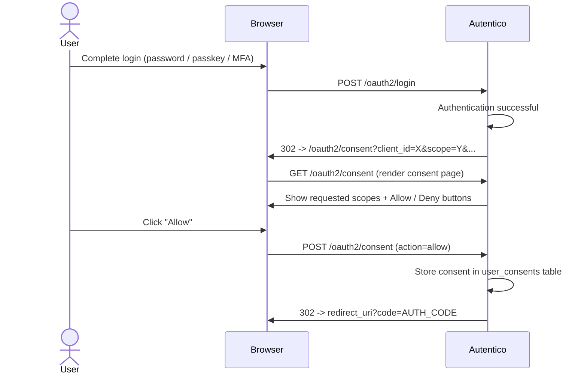

import { Aside } from '@astrojs/starlight/components';

The consent screen allows users to review and approve the scopes an OAuth2 client is requesting before an authorization code is issued. Consent is per-client and per-user -- once granted, it is remembered and not re-prompted unless scopes change.

## Consent flow



If the user clicks **Deny**, Autentico redirects back to the client with `error=access_denied` per RFC 6749 Section 4.1.2.1.

## Enabling consent for a client

Consent is controlled by the `consent_required` field on the client. When `consent_required` is `true`, users must approve scopes before an authorization code is issued.

Set it when creating or updating a client:

```bash
curl -X POST https://auth.example.com/admin/api/clients \
  -H "Authorization: Bearer $ADMIN_TOKEN" \
  -H "Content-Type: application/json" \
  -d '{
    "client_id": "my-app",
    "client_name": "My Application",
    "redirect_uris": ["https://app.example.com/callback"],
    "grant_types": ["authorization_code", "refresh_token"],
    "response_types": ["code"],
    "scopes": "openid profile email offline_access",
    "client_type": "public",
    "token_endpoint_auth_method": "none",
    "consent_required": true
  }'
```

When `consent_required` is `false` or not set, the consent screen is skipped entirely and the authorization code is issued immediately after authentication.

## Scope descriptions

The consent screen displays human-readable descriptions for standard scopes:

| Scope | Description shown to user |
|---|---|
| `openid` | Verify your identity |
| `profile` | View your profile information |
| `email` | View your email address |
| `address` | View your address |
| `phone` | View your phone number |
| `offline_access` | Stay signed in between sessions |

Custom scopes are displayed by their raw scope name.

## Consent persistence

When a user approves a consent request, the decision is stored in the `user_consents` table with the following fields:

| Column | Description |
|---|---|
| `id` | Unique consent record ID |
| `user_id` | The user who granted consent |
| `client_id` | The client that received consent |
| `scopes` | Space-separated list of approved scopes |
| `granted_at` | Timestamp of when consent was granted |

A unique constraint on `(user_id, client_id)` ensures only one consent record exists per user-client pair. When a user re-approves, the existing record is updated with the new scopes and timestamp.

## When re-consent is triggered

Autentico skips the consent screen if all of these conditions are true:

1. The user has a stored consent record for the client
2. All requested scopes are covered by the previously granted scopes
3. The `prompt` parameter does not include `consent`

Re-consent is triggered when:

- **New scopes are requested** -- if the client requests a scope not covered by the stored consent, the user is re-prompted
- **`prompt=consent`** -- per OIDC Core Section 3.1.2.1, the `prompt=consent` parameter forces re-prompting even if consent was previously granted
- **No prior consent exists** -- the user has never approved scopes for this client

## Security

The consent form is protected against parameter tampering using an HMAC-SHA256 signature (`consent_sig`). The signature covers all OAuth2 parameters and the user ID, and is verified on form submission. This prevents an attacker from modifying the redirect URI, client ID, or scopes between the GET and POST requests.

<Aside type="tip">
First-party clients that you fully trust (such as your own frontend) can set `consent_required` to `false` to skip the consent screen. Third-party clients should always require consent so users can review what data they are sharing.
</Aside>
