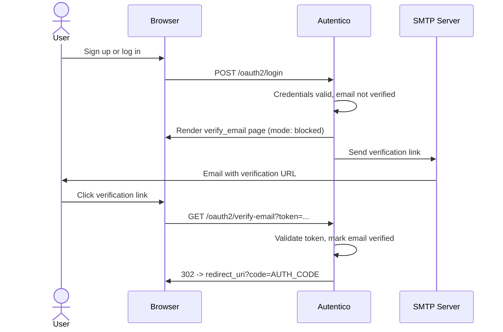

import { Aside } from '@astrojs/starlight/components';

When `require_email_verification` is enabled, users must verify their email address before they can complete the OAuth2 login flow. Unverified users are shown a verification page after login instead of receiving an authorization code.

## Verification flow



The verification link contains a cryptographically random token (32 bytes, base64url-encoded). Only the SHA-256 hash of the token is stored in the database, so a database compromise does not expose valid verification links.

## Configuration

Enable email verification and set the token expiration via the admin API:

```bash
curl -X PUT https://auth.example.com/admin/api/settings \
  -H "Authorization: Bearer $ADMIN_TOKEN" \
  -H "Content-Type: application/json" \
  -d '{
    "require_email_verification": "true",
    "email_verification_expiration": "24h"
  }'
```

### Settings

| Setting | Default | Description |
|---|---|---|
| `require_email_verification` | `false` | When `true`, unverified users cannot complete login |
| `email_verification_expiration` | `24h` | How long a verification link remains valid |

### SMTP requirements

Email verification requires a working SMTP configuration. Set these settings via the admin API or Admin UI:

| Setting | Description |
|---|---|
| `smtp_host` | SMTP server hostname |
| `smtp_port` | SMTP server port (typically `587`) |
| `smtp_username` | SMTP authentication username |
| `smtp_password` | SMTP authentication password |
| `smtp_from` | Sender email address |

<Aside type="caution">
Without SMTP configured, verification emails cannot be sent. Users will be stuck on the verification page with no way to receive their link.
</Aside>

## Endpoints

### Verify email

**`GET {oauth_path}/verify-email?token=...&client_id=...&redirect_uri=...&scope=...&state=...`**

Validates the verification token and, if valid, marks the user's email as verified, creates an IdP session, issues an authorization code, and redirects to the client. The OAuth2 parameters are carried through the verification link so the login flow resumes seamlessly.

If the token is expired or invalid, the user is shown the verification page in "expired" mode with an option to request a new link.

### Resend verification

**`POST {oauth_path}/resend-verification`**

Generates a new verification token and sends a fresh verification email. Accepts form-encoded parameters:

| Parameter | Description |
|---|---|
| `username` | The user's username |
| `redirect_uri` | OAuth2 redirect URI (carried through) |
| `state` | OAuth2 state parameter (carried through) |
| `client_id` | OAuth2 client ID (carried through) |
| `scope` | OAuth2 scope (carried through) |

The endpoint always shows a success message regardless of whether the user exists, to prevent user enumeration. A random delay is added for the same reason.

## Security considerations

- **Token hashing** -- only the SHA-256 hash of the token is stored; the raw token exists only in the email link
- **Single-use** -- once verified, the token cannot be reused
- **Expiration** -- tokens expire after the configured duration (default: 24 hours)
- **Parameter integrity** -- OAuth2 parameters in the verification link are protected by an HMAC signature (`authorize_sig`) to prevent tampering
- **Timing-safe** -- the resend endpoint uses random delays to prevent timing-based user enumeration
