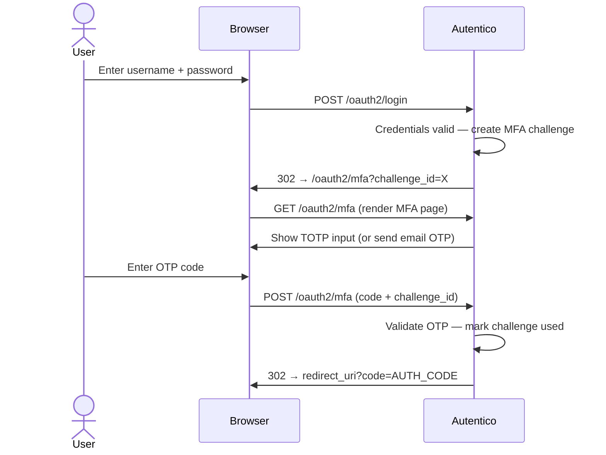

import { Aside, Tabs, TabItem } from '@astrojs/starlight/components';

When `mfa_enabled` is `true`, all users must complete an MFA step after password authentication before an authorization code is issued.

## MFA flow



The MFA challenge is a short-lived, single-use token (5 minutes). If it expires, the user is redirected back to the login page.

## TOTP (Authenticator App)

TOTP uses time-based one-time passwords compatible with any RFC 6238 authenticator app — Google Authenticator, Authy, 1Password, Bitwarden, and others.

**Enrollment** happens automatically on first login after MFA is enabled. Users who have not yet set up TOTP are shown a QR code on the MFA page:

{/* TODO: add screenshot of TOTP enrollment page (QR code) */}

1. Scan the QR code with an authenticator app
2. Enter the 6-digit code from the app to confirm enrollment
3. On all future logins, enter the code from the app

The TOTP secret is stored per-user in the database. The QR code is generated server-side — no third-party service is involved.

**Issuer name** displayed in the authenticator app comes from the `theme_title` setting.

## Email OTP

Email OTP sends a one-time code to the user's registered email address on each login. No enrollment step is required.

To use email OTP, set:

```
mfa_method = email
```

And configure SMTP:

```
smtp_host = smtp.example.com
smtp_port = 587
smtp_username = auth@example.com
smtp_password = your-smtp-password
smtp_from = auth@example.com
```

<Aside type="caution">
Email OTP is only as secure as the user's email account. TOTP is generally preferred for stronger security.
</Aside>

## Enabling MFA

In the Admin UI: Settings → set `mfa_enabled` to `true` and choose `mfa_method`.

Via API:

```bash
curl -X PUT https://auth.example.com/admin/api/settings \
  -H "Authorization: Bearer $ADMIN_TOKEN" \
  -H "Content-Type: application/json" \
  -d '{"mfa_enabled": "true", "mfa_method": "totp"}'
```

## Trusted devices

After a successful MFA verification, users can check **"Trust this device"** to skip MFA on future logins from the same browser. See [Trusted Devices](/authentication/trusted-devices/) for details.

<Aside type="tip">
MFA is applied to password authentication only. Passkey authentication does not go through the MFA flow — a passkey is itself a strong second factor.
</Aside>
