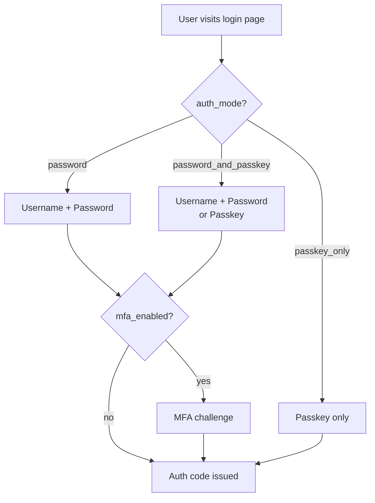

import { Aside } from '@astrojs/starlight/components';

Autentico supports three authentication modes, controlled by the `auth_mode` runtime setting. The mode can be changed at any time without restarting the server.

## Authentication modes



| Mode | Description |
|---|---|
| `password` | Standard username and password. MFA is applied on top if `mfa_enabled` is `true`. This is the default. |
| `password_and_passkey` | Users can authenticate with either a password or a registered passkey. Password logins can include MFA; passkey logins do not (a passkey is itself a strong factor). |
| `passkey_only` | Password authentication is disabled. Users must authenticate with a passkey. First-time users are walked through passkey registration during their initial login. |

## Changing the auth mode

**Via Admin UI**: Settings → `auth_mode`.

**Via API**:
```bash
curl -X PUT https://auth.example.com/admin/api/settings \
  -H "Authorization: Bearer $ADMIN_TOKEN" \
  -H "Content-Type: application/json" \
  -d '{"auth_mode": "password_and_passkey"}'
```

<Aside type="caution">
Switching to `passkey_only` will prevent users without registered passkeys from logging in. Ensure users have passkeys enrolled before making this switch, or enable it gradually on a per-client basis using [per-client overrides](/configuration/per-client-overrides/).
</Aside>

## Login page theming

The login page is server-rendered HTML. It respects the user's `prefers-color-scheme` media query for dark mode. Customize it via the `theme_*` settings.

**Available CSS variables:**

```css
:root {
  --font-size: 16px;
  --font-family: system-ui, -apple-system, "Segoe UI", Roboto, "Helvetica Neue", Arial, sans-serif;

  /* Colors */
  --color-primary: #2e5bff;
  --color-accent: #188060;
  --color-danger: #ff4848;
  --color-text: #0f0f0f;
  --color-inverse: #ffffff;
  --color-background: #f1f1f1;
  --color-card: #ffffff;
  --color-border: #696969;

  /* Layout */
  --border-radius: 2px;
  --form-width: 380px;
  --form-padding: 30px;
  --form-gap: 16px;
  --form-shadow: 0 4px 8px rgba(0, 0, 0, 0.1);

  /* Logo */
  --logo-size: 96px;
}

@media (prefers-color-scheme: dark) {
  :root {
    --color-text: #e7e7e7;
    --color-background: #0f0f0f;
    --color-card: #1e1f22;
    --color-border: #cccccc;
  }
}
```

Set your overrides as inline CSS via `theme_css_inline`, or point `theme_css_file` to a file on disk.

{/* TODO: add screenshot of login page (light and dark mode) */}
