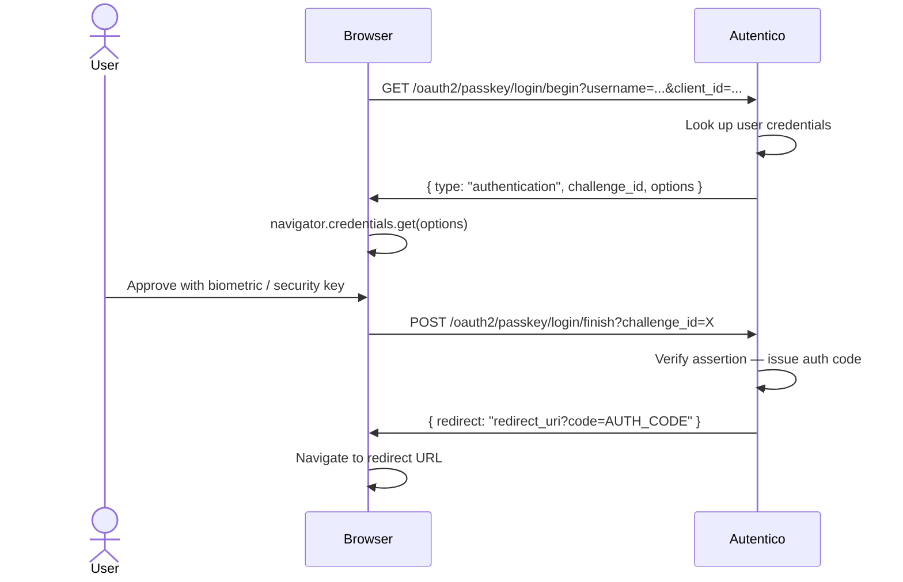
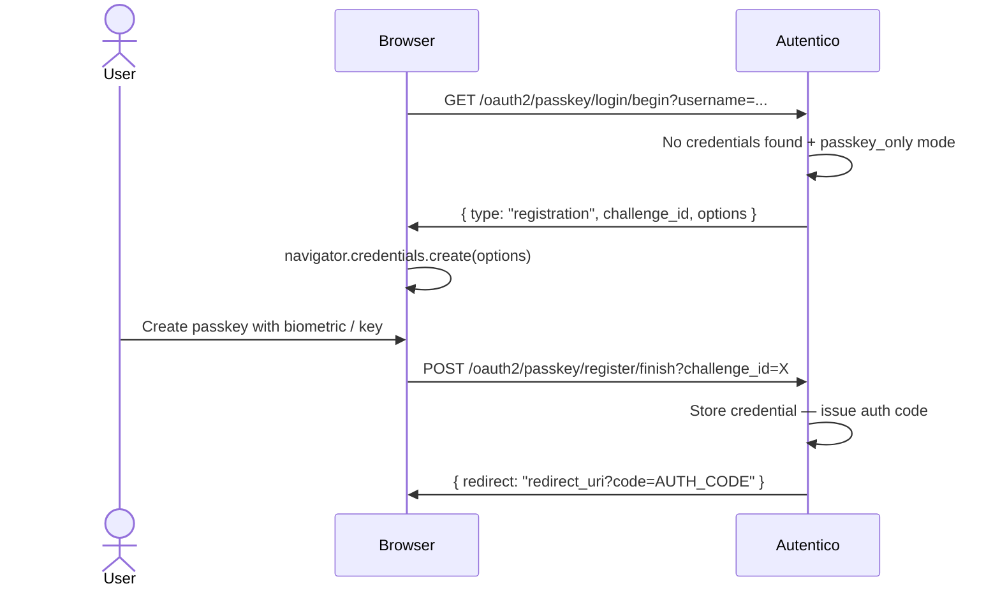

import { Aside } from '@astrojs/starlight/components';

Autentico supports WebAuthn (FIDO2) passkeys via the `go-webauthn/webauthn` library. Passkeys use public-key cryptography bound to the user's device — platform authenticators (Face ID, Touch ID, Windows Hello) and hardware security keys (YubiKey, etc.) are both supported.

## Passkey authentication flow



Challenges are short-lived (5 minutes) and single-use. The challenge data is stored in the `passkey_challenges` table.

## Passkey-only first login (registration flow)

In `passkey_only` mode, users who have no registered passkeys are walked through registration on their first login:



After first login, the registered credential is stored in `passkey_credentials` and used for all subsequent logins.

## Relying party configuration

The WebAuthn relying party name — shown in the browser's passkey prompt — is controlled by the `passkey_rp_name` runtime setting. Set it to your application or organization name.

The relying party ID is derived from `AUTENTICO_APP_URL` (the hostname component). This is a security boundary in WebAuthn: credentials registered for `auth.example.com` cannot be used on a different origin.

<Aside type="caution">
The relying party ID is set at registration time. If `AUTENTICO_APP_URL` changes, existing passkey credentials will no longer work. Plan your URL before enabling passkeys in production.
</Aside>

## Enabling passkeys

Set `auth_mode` to `password_and_passkey` or `passkey_only`:

```bash
curl -X PUT https://auth.example.com/admin/api/settings \
  -H "Authorization: Bearer $ADMIN_TOKEN" \
  -H "Content-Type: application/json" \
  -d '{"auth_mode": "password_and_passkey", "passkey_rp_name": "My Company"}'
```

The login page will show the passkey option automatically once this is set.

{/* TODO: add screenshot of login page with passkey option */}
