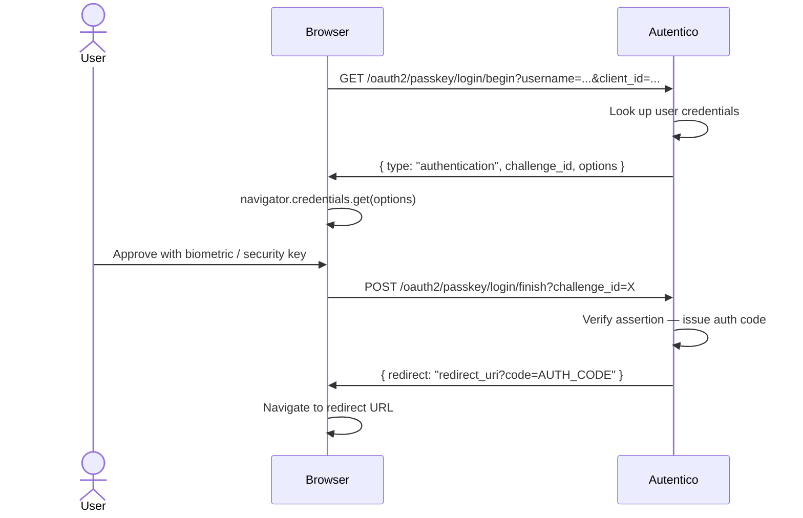
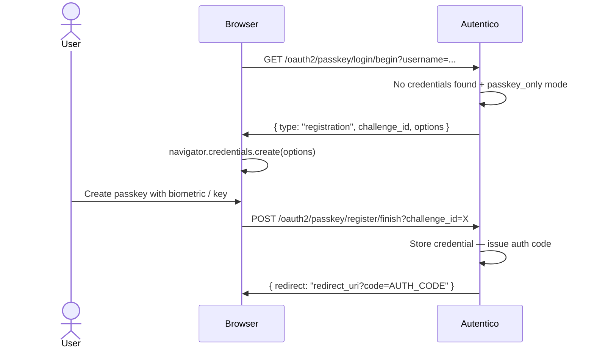

import { Aside } from '@astrojs/starlight/components';

Autentico supports WebAuthn (FIDO2) passkeys via the `go-webauthn/webauthn` library. Passkeys use public-key cryptography bound to the user's device — platform authenticators (Face ID, Touch ID, Windows Hello) and hardware security keys (YubiKey, etc.) are both supported.

## Passkey authentication flow



Challenges are short-lived (5 minutes) and single-use. The challenge data is stored in the `passkey_challenges` table.

## Passkey-only first login (registration flow)

In `passkey_only` mode, users who have no registered passkeys are walked through registration on their first login:



After first login, the registered credential is stored in `passkey_credentials` and used for all subsequent logins.

## Relying party configuration

The WebAuthn relying party name — shown in the browser's passkey prompt — is controlled by the `passkey_rp_name` runtime setting. Set it to your application or organization name.

The relying party ID is derived from `AUTENTICO_APP_URL` (the hostname component). This is a security boundary in WebAuthn: credentials registered for `auth.example.com` cannot be used on a different origin.

<Aside type="caution">
The relying party ID is set at registration time. If `AUTENTICO_APP_URL` changes, existing passkey credentials will no longer work. Plan your URL before enabling passkeys in production.
</Aside>

## Enabling passkeys

Set `auth_mode` to `password_and_passkey` or `passkey_only`:

```bash
curl -X PUT https://auth.example.com/admin/api/settings \
  -H "Authorization: Bearer $ADMIN_TOKEN" \
  -H "Content-Type: application/json" \
  -d '{"auth_mode": "password_and_passkey", "passkey_rp_name": "My Company"}'
```

The login page will show the passkey option automatically once this is set.

## Login modes

The `passkey_login_mode` setting controls how passkeys are presented on the login page. Each mode suits different deployment scenarios and user bases.

### `username_first` (default)

The user types their username first, then authenticates with their registered passkey. The server looks up the user's credentials and sends them to the browser as `allowCredentials`, so the authenticator only prompts for matching passkeys.

This is the safest default — it works with every authenticator type and doesn't depend on discoverable credential support.

### `discoverable`

A "Sign in with passkey" button appears on the login page. Clicking it triggers a discoverable credential ceremony — the browser or authenticator shows all passkeys registered for this relying party, and the user picks one. No username is needed.

This works best with:
- **Apple devices** — iCloud Keychain shows an account picker natively
- **Windows Hello** — built-in account selection
- **Hardware security keys** — YubiKeys and other FIDO2 keys with resident key storage

<Aside type="note">
Google Password Manager handles discoverable credentials differently — it may still prompt for a username in its own UI before releasing the credential. For Google Password Manager users, the `conditional` mode provides a more natural experience.
</Aside>

The username and password fields remain visible for users who prefer password login or don't have a passkey registered.

### `conditional`

The browser automatically surfaces registered passkeys in the username field's autofill dropdown when the login page loads. The user sees their passkey alongside saved passwords without clicking any button — they simply focus the username field and pick a passkey from the autofill suggestions.

This is the most seamless mode for environments where users rely on password managers (Chrome + Google Password Manager, Safari + iCloud Keychain, Firefox). The passkey appears as just another autofill option.

Technically, this uses `navigator.credentials.get()` with `mediation: 'conditional'` and adds `autocomplete="username webauthn"` to the username input. If the browser doesn't support conditional mediation, the passkey button remains available as a fallback.

### `passkey_only`

No username or password fields are shown — only a "Sign in with passkey" button. This is for deployments that have fully committed to passwordless authentication.

<Aside type="caution">
For the username field to be fully hidden, both `auth_mode` and `passkey_login_mode` must be set to `passkey_only`. If `auth_mode` is `password_and_passkey`, the username field remains visible for password fallback even when `passkey_login_mode` is `passkey_only`.
</Aside>

### Choosing a mode

| Mode | Best for | Username required | Password fallback |
|------|----------|:-:|:-:|
| `username_first` | Maximum compatibility, gradual passkey adoption | Yes | Yes |
| `discoverable` | Platform authenticators (Apple, Windows Hello), hardware keys | No | Yes |
| `conditional` | Password managers, autofill-heavy environments | No | Yes |
| `passkey_only` | Fully passwordless deployments | No | No |

### Configuring via API

```bash
curl -X PUT https://auth.example.com/admin/api/settings \
  -H "Authorization: Bearer $ADMIN_TOKEN" \
  -H "Content-Type: application/json" \
  -d '{"passkey_login_mode": "discoverable"}'
```

The setting takes effect immediately — the next login page render will use the new mode.

## Discoverable credentials (resident keys)

Discoverable passkey login (`discoverable`, `conditional`, and `passkey_only` modes) relies on **resident keys** — credentials stored on the authenticator itself, not just on the server. During registration, Autentico requests `ResidentKey: preferred`, which means most modern authenticators will create a discoverable credential by default.

The authenticator stores a `userHandle` (the user's internal ID) alongside the private key. During a discoverable login, the authenticator returns this `userHandle` in its signed assertion, allowing the server to identify the user without a username.

<Aside type="note">
Older or storage-limited authenticators may not support resident keys. Users on these devices should use `username_first` mode or register their passkey on a different authenticator.
</Aside>
