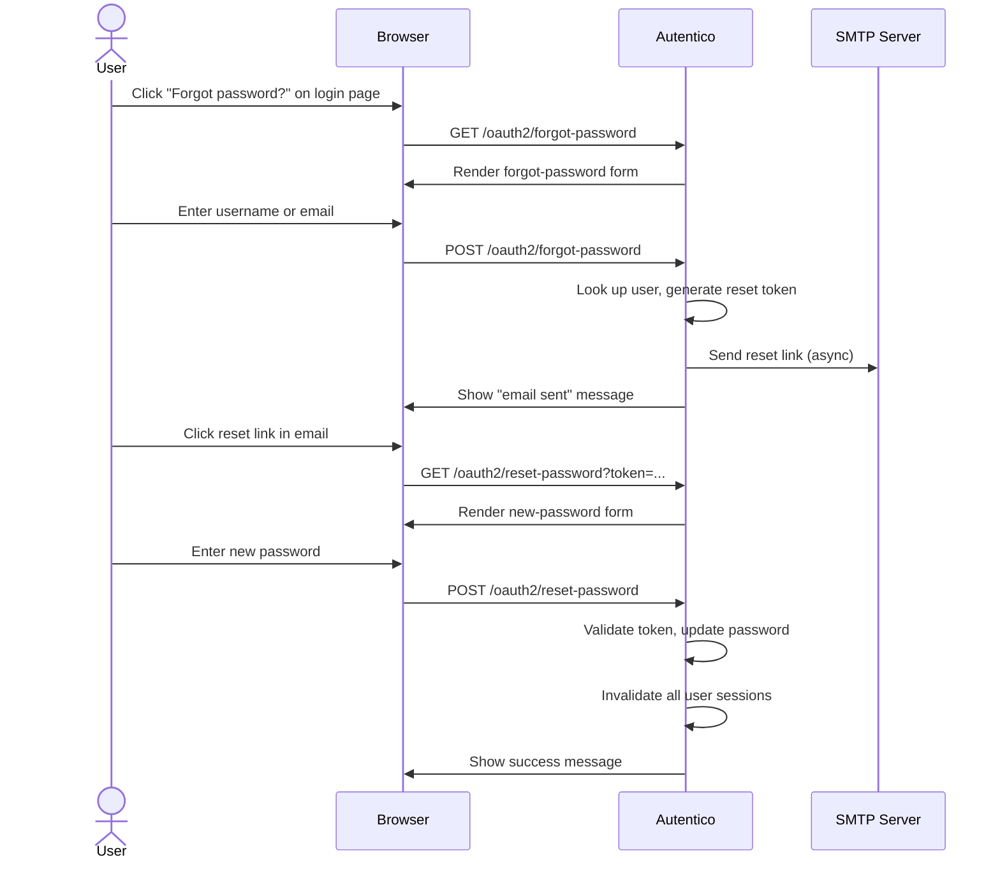

import { Aside } from '@astrojs/starlight/components';

Autentico provides a self-service password reset flow that allows users to reset their password via an email link. The flow uses single-use, time-limited tokens and invalidates all existing sessions after a successful reset.

## Password reset flow



## Configuration

Set the reset token expiration via the admin API:

```bash
curl -X PUT https://auth.example.com/admin/api/settings \
  -H "Authorization: Bearer $ADMIN_TOKEN" \
  -H "Content-Type: application/json" \
  -d '{"password_reset_expiration": "1h"}'
```

| Setting | Default | Description |
|---|---|---|
| `password_reset_expiration` | `1h` | How long a password reset link remains valid |

### SMTP requirements

Password reset requires a working SMTP configuration. See [Email Verification](/authentication/email-verification/) for SMTP settings.

## Endpoints

### Forgot password

**`GET {oauth_path}/forgot-password`** -- renders the forgot-password form.

**`POST {oauth_path}/forgot-password`** -- processes the form submission.

| Parameter | Required | Description |
|---|---|---|
| `identifier` | Yes | Username or email address |
| `redirect_uri` | No | OAuth2 redirect URI (carried through for return-to-login) |
| `state` | No | OAuth2 state parameter |
| `client_id` | No | OAuth2 client ID |
| `scope` | No | OAuth2 scope |

The endpoint always shows a success message ("email sent") regardless of whether the user exists or has a verified email, to prevent user enumeration. A random delay is added for the same reason.

The user can be identified by either username or email address (verified emails only).

### Reset password

**`GET {oauth_path}/reset-password?token=...`** -- validates the token and renders the new-password form.

**`POST {oauth_path}/reset-password`** -- processes the password change.

| Parameter | Required | Description |
|---|---|---|
| `token` | Yes | The reset token from the email link |
| `password` | Yes | The new password |
| `confirm_password` | Yes | Must match `password` |

The new password is validated against the configured minimum and maximum password length settings (`validation_min_password_length`, `validation_max_password_length`).

## Token security

| Property | Detail |
|---|---|
| **Generation** | 32 bytes of cryptographic randomness, base64url-encoded |
| **Storage** | Only the SHA-256 hash is stored in `password_reset_tokens` |
| **Single-use** | Marked as used (`used_at` timestamp) after successful reset |
| **Expiration** | Configurable via `password_reset_expiration` (default: 1 hour) |
| **Invalidation** | When a new token is requested, all previous unused tokens for the user are invalidated |

## Post-reset actions

After a successful password reset:

1. The user's password is updated with a new bcrypt hash
2. The reset token is marked as used
3. **All OAuth sessions** for the user are deactivated
4. **All IdP sessions** for the user are deactivated
5. An `password_reset_completed` audit event is logged

This ensures that if the password was compromised, all existing sessions are terminated and the attacker is forced to re-authenticate.

<Aside type="tip">
The forgot-password link is available on the login page. Users can access it during the OAuth2 authorization flow, and the OAuth2 parameters are preserved through the reset process so they can return to the login page afterward.
</Aside>
