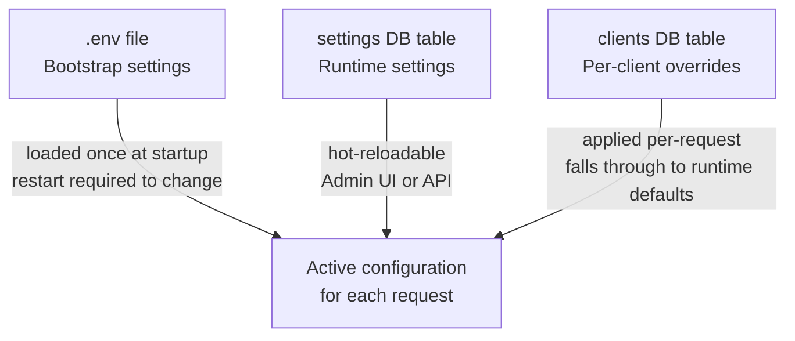

import { Aside } from '@astrojs/starlight/components';

Autentico uses a three-layer configuration system. Each layer has a different scope, mutability, and purpose.

## Layer 1: Bootstrap settings

Stored in the `.env` file. These are infrastructure-level values that are loaded once at startup and cannot change without restarting the server. They include the database path, application URL, RSA private key, and all cryptographic secrets.

Generated by `autentico init`. You typically set these once per deployment and don't touch them again.

→ [Bootstrap Settings reference](/configuration/bootstrap/)

## Layer 2: Runtime settings

Stored in the `settings` table in the SQLite database. These control the runtime behavior of the server — token lifetimes, MFA settings, SMTP configuration, theming, validation rules, and more.

Changes take effect immediately without restarting the server. They can be edited via the Admin UI Settings page or via the `PUT /admin/api/settings` API endpoint.

→ [Runtime Settings reference](/configuration/runtime-settings/)

## Layer 3: Per-client overrides

Stored in the `clients` table. Each registered OAuth2 client can override a subset of the runtime settings for requests originating from that client. Unset fields fall through to the runtime defaults.

This allows different token TTLs, audience values, or trusted device configurations for different relying parties without affecting global defaults.

→ [Per-Client Overrides reference](/configuration/per-client-overrides/)

## Precedence

When processing a request, Autentico resolves configuration in this order:

1. Start with the runtime settings (Layer 2)
2. Apply any per-client overrides for the requesting client (Layer 3)
3. The bootstrap config (Layer 1) is always available but is never overridden

<Aside type="caution">
The `onboarded` and `private_key` settings keys are protected — they cannot be set or updated via the settings API, only through internal flows.
</Aside>
