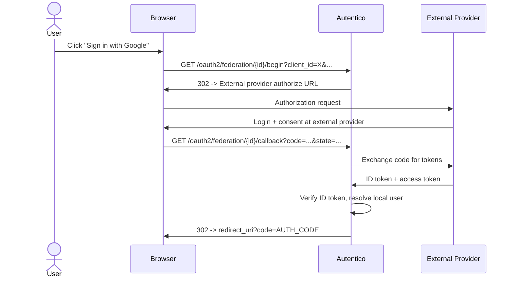

import { Aside } from '@astrojs/starlight/components';

Federation allows users to authenticate with external OIDC identity providers (such as Google, GitHub, or any OIDC-compliant provider) instead of using a local username and password. When a user logs in via a federation provider, Autentico creates or links a local user account and issues tokens as usual.

## How it works



The OAuth2 authorization parameters (client_id, redirect_uri, scope, state, code_challenge) are preserved through the federation flow using an HMAC-signed state parameter.

## User resolution

When a user authenticates through a federation provider, Autentico resolves the local user account in this order:

1. **Existing federated identity** -- if the (provider_id, provider_sub) pair is already linked to a local user, that user is used
2. **Verified email match** -- if both the external provider and the local account have verified the same email address, the accounts are automatically linked
3. **New account** -- if no match is found, a new local user is created with a derived username and a random unusable password

<Aside type="note">
Auto-linking by email only occurs when the email is verified on both sides (the external provider reports `email_verified: true` and the local account has a verified email). This prevents account takeover via unverified email claims.
</Aside>

## Managing providers via admin API

All federation provider endpoints require admin authentication.

| Method | Endpoint | Description |
|---|---|---|
| `GET` | `/admin/api/federation` | List all providers (paginated) |
| `POST` | `/admin/api/federation` | Create a new provider |
| `GET` | `/admin/api/federation/{id}` | Get a provider by ID |
| `PUT` | `/admin/api/federation/{id}` | Update a provider |
| `DELETE` | `/admin/api/federation/{id}` | Delete a provider |

### Create a provider

```bash
curl -X POST https://auth.example.com/admin/api/federation \
  -H "Authorization: Bearer $ADMIN_TOKEN" \
  -H "Content-Type: application/json" \
  -d '{
    "id": "google",
    "name": "Google",
    "issuer": "https://accounts.google.com",
    "client_id": "your-google-client-id",
    "client_secret": "your-google-client-secret",
    "enabled": true,
    "sort_order": 1
  }'
```

### Provider fields

| Field | Required | Description |
|---|---|---|
| `id` | Yes | Unique slug identifier (e.g. `google`, `github`). Used in URLs. |
| `name` | Yes | Display name shown on the login page |
| `issuer` | Yes | OIDC issuer URL (must support `/.well-known/openid-configuration`) |
| `client_id` | Yes | Client ID registered with the external provider |
| `client_secret` | Yes | Client secret from the external provider |
| `icon_svg` | No | SVG markup for the provider icon on the login page |
| `enabled` | No | Whether the provider is active (default: `true`) |
| `sort_order` | No | Display order on the login page (lower numbers first) |

### List providers

```bash
curl "https://auth.example.com/admin/api/federation?sort=sort_order&order=asc" \
  -H "Authorization: Bearer $ADMIN_TOKEN"
```

Supports query parameters:

| Parameter | Description |
|---|---|
| `sort` | Sort field: `name`, `issuer`, `client_id`, `sort_order`, `enabled`, `created_at` |
| `order` | Sort order: `asc` (default), `desc` |
| `search` | Search across `name`, `issuer`, `client_id` |
| `enabled` | Filter by enabled status: `1` or `0` |
| `limit` | Max results per page (1--100, default 100) |
| `offset` | Number of results to skip (default 0) |

### Update a provider

```bash
curl -X PUT https://auth.example.com/admin/api/federation/google \
  -H "Authorization: Bearer $ADMIN_TOKEN" \
  -H "Content-Type: application/json" \
  -d '{
    "name": "Google",
    "issuer": "https://accounts.google.com",
    "client_id": "updated-client-id",
    "client_secret": "updated-secret",
    "enabled": true,
    "sort_order": 1
  }'
```

### Delete a provider

```bash
curl -X DELETE https://auth.example.com/admin/api/federation/google \
  -H "Authorization: Bearer $ADMIN_TOKEN"
```

## Federation endpoints (public)

These endpoints are used during the login flow and are not authenticated.

| Method | Endpoint | Description |
|---|---|---|
| `GET` | `{oauth_path}/federation/{id}/begin` | Start federation login (redirects to external provider) |
| `GET` | `{oauth_path}/federation/{id}/callback` | Handle callback from external provider |
| `GET` | `{oauth_path}/federation/{id}/icon` | Serve the provider's SVG icon |

### Begin federation login

The begin endpoint accepts the standard OAuth2 authorization parameters as query strings so they can be preserved through the external provider redirect:

```
GET /oauth2/federation/google/begin?client_id=my-app&redirect_uri=https://app.example.com/callback&scope=openid+profile+email&state=abc123&code_challenge=...&code_challenge_method=S256
```

## Provider icon security

Provider icons (SVG) are served via a dedicated endpoint (`{oauth_path}/federation/{id}/icon`) with the following security measures:

- SVGs are served with `Content-Type: image/svg+xml` and loaded via `` tags, which disables script execution
- A restrictive `Content-Security-Policy` header (`default-src 'none'; style-src 'unsafe-inline'; sandbox`) is set on direct navigation
- Icons are cached with ETags and a 5-minute max-age

## Database tables

### `federation_providers` table

| Column | Type | Description |
|---|---|---|
| `id` | TEXT | Primary key (admin-chosen slug) |
| `name` | TEXT | Display name |
| `issuer` | TEXT | OIDC issuer URL |
| `client_id` | TEXT | OAuth2 client ID at the external provider |
| `client_secret` | TEXT | OAuth2 client secret |
| `icon_svg` | TEXT | SVG markup (nullable) |
| `enabled` | BOOLEAN | Whether the provider is active |
| `sort_order` | INTEGER | Display order |
| `created_at` | DATETIME | Creation timestamp |

### `federated_identities` table

| Column | Type | Description |
|---|---|---|
| `id` | TEXT | Primary key (xid) |
| `provider_id` | TEXT | Foreign key to `federation_providers.id` |
| `provider_user_id` | TEXT | The `sub` claim from the external provider |
| `user_id` | TEXT | Foreign key to `users.id` |
| `email` | TEXT | Email from the external provider (nullable) |
| `created_at` | DATETIME | When the link was created |

## SSRF protection

When Autentico communicates with external providers (OIDC discovery and token exchange), it uses a restricted HTTP client that:

- Blocks redirects to private/loopback IP ranges (127.0.0.0/8, 10.0.0.0/8, 172.16.0.0/12, 192.168.0.0/16, link-local, IPv6 equivalents)
- Limits the number of redirects to 5
- Enforces a 10-second timeout

This prevents SSRF attacks where a malicious issuer URL could be used to probe internal infrastructure.
