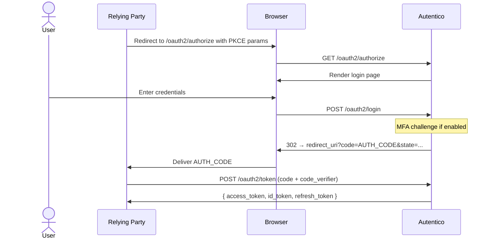

import { Aside, Tabs, TabItem } from '@astrojs/starlight/components';

The Authorization Code flow is the recommended OAuth2 grant type for web applications, SPAs, and native apps. Autentico supports PKCE (RFC 7636) for public clients that cannot securely store a client secret.

## Flow overview



## Step 1: Generate PKCE parameters

PKCE is required for public clients and recommended for all clients.

```javascript
function generateCodeVerifier() {
  const array = new Uint8Array(32);
  crypto.getRandomValues(array);
  return btoa(String.fromCharCode(...array))
    .replace(/\+/g, '-').replace(/\//g, '_').replace(/=+$/, '');
}

async function generateCodeChallenge(verifier) {
  const data = new TextEncoder().encode(verifier);
  const digest = await crypto.subtle.digest('SHA-256', data);
  return btoa(String.fromCharCode(...new Uint8Array(digest)))
    .replace(/\+/g, '-').replace(/\//g, '_').replace(/=+$/, '');
}

const codeVerifier = generateCodeVerifier();
// Store codeVerifier for the token exchange step
sessionStorage.setItem('code_verifier', codeVerifier);
const codeChallenge = await generateCodeChallenge(codeVerifier);
```

## Step 2: Authorization request

Redirect the user's browser to the authorization endpoint:

```
GET /oauth2/authorize
  ?response_type=code
  &client_id=YOUR_CLIENT_ID
  &redirect_uri=https://yourapp.com/callback
  &scope=openid profile email
  &state=RANDOM_STATE_VALUE
  &nonce=RANDOM_NONCE_VALUE
  &code_challenge=PKCE_CHALLENGE
  &code_challenge_method=S256
```

| Parameter | Required | Description |
|---|---|---|
| `response_type` | Yes | Must be `code` |
| `client_id` | Yes | Your registered client ID |
| `redirect_uri` | Yes | Must exactly match a registered redirect URI |
| `scope` | Yes | Space-separated scopes. Must include `openid` for OIDC. |
| `state` | Recommended | Opaque value for CSRF protection. Returned unchanged. |
| `nonce` | Recommended | Opaque value embedded in the ID token to prevent replay attacks. |
| `code_challenge` | Required for public clients | Base64url-encoded SHA-256 hash of `code_verifier` |
| `code_challenge_method` | Required with `code_challenge` | `S256` (recommended) or `plain` |

## Step 3: User authenticates

Autentico renders the login page. After successful authentication (including MFA if enabled), the user is redirected to your `redirect_uri`:

```
https://yourapp.com/callback
  ?code=AUTHORIZATION_CODE
  &state=RANDOM_STATE_VALUE
```

Verify that `state` matches what you sent. The authorization code is short-lived (default 10 minutes) and single-use.

## Step 4: Token exchange

Exchange the authorization code for tokens at the token endpoint.

<Tabs>
  <TabItem label="Public client (PKCE)">
  ```bash
  curl -X POST https://auth.example.com/oauth2/token \
    -H "Content-Type: application/x-www-form-urlencoded" \
    -d "grant_type=authorization_code" \
    -d "client_id=YOUR_CLIENT_ID" \
    -d "code=AUTHORIZATION_CODE" \
    -d "redirect_uri=https://yourapp.com/callback" \
    -d "code_verifier=YOUR_CODE_VERIFIER"
  ```
  </TabItem>
  <TabItem label="Confidential client (Basic Auth)">
  ```bash
  curl -X POST https://auth.example.com/oauth2/token \
    -u "YOUR_CLIENT_ID:YOUR_CLIENT_SECRET" \
    -H "Content-Type: application/x-www-form-urlencoded" \
    -d "grant_type=authorization_code" \
    -d "code=AUTHORIZATION_CODE" \
    -d "redirect_uri=https://yourapp.com/callback"
  ```
  </TabItem>
  <TabItem label="Confidential client (POST)">
  ```bash
  curl -X POST https://auth.example.com/oauth2/token \
    -H "Content-Type: application/x-www-form-urlencoded" \
    -d "grant_type=authorization_code" \
    -d "client_id=YOUR_CLIENT_ID" \
    -d "client_secret=YOUR_CLIENT_SECRET" \
    -d "code=AUTHORIZATION_CODE" \
    -d "redirect_uri=https://yourapp.com/callback"
  ```
  </TabItem>
</Tabs>

**Response:**

```json
{
  "access_token": "eyJhbGciOiJSUzI1NiIsInR5cCI6IkpXVCJ9...",
  "token_type": "Bearer",
  "expires_in": 900,
  "refresh_token": "eyJhbGciOiJIUzI1NiIsInR5cCI6IkpXVCJ9...",
  "id_token": "eyJhbGciOiJSUzI1NiIsInR5cCI6IkpXVCJ9..."
}
```

The `id_token` is a JWT containing identity claims about the authenticated user. See [Token Structure & Claims](/protocol/token-structure/) for details.

## Keycloak-compatible path

Autentico also registers the Keycloak-compatible token endpoint:

```
POST /oauth2/protocol/openid-connect/token
```

This allows existing Keycloak client integrations to work by changing only the base URL.

<Aside type="tip">
The `redirect_uri` in the token exchange must exactly match the one used in the authorization request — not just the registered URIs. This is an OAuth2 security requirement.
</Aside>
