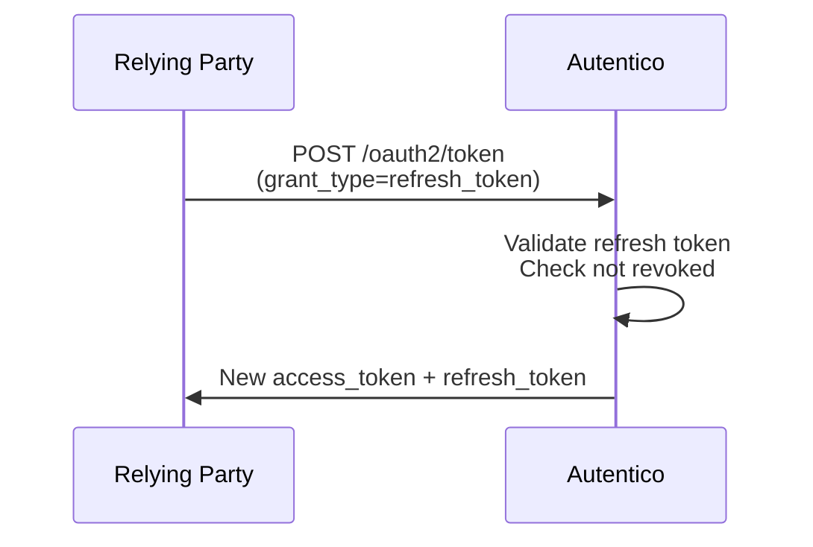

Refresh tokens allow relying parties to obtain new access tokens after the current one expires, without sending the user back through the login flow.

## Flow



## Request

```bash
curl -X POST https://auth.example.com/oauth2/token \
  -H "Content-Type: application/x-www-form-urlencoded" \
  -d "grant_type=refresh_token" \
  -d "refresh_token=YOUR_REFRESH_TOKEN" \
  -d "client_id=YOUR_CLIENT_ID"
  # Add client_secret or PKCE if required by your client type
```

**Response:**

```json
{
  "access_token": "eyJhbGciOiJSUzI1NiIsInR5cCI6IkpXVCJ9...",
  "token_type": "Bearer",
  "expires_in": 900,
  "refresh_token": "eyJhbGciOiJIUzI1NiIsInR5cCI6IkpXVCJ9..."
}
```

A new refresh token is issued with each refresh. Store the new refresh token — the old one is invalidated.

## Refresh token lifetime

The default refresh token lifetime is 30 days (`720h`). Configure globally via the `refresh_token_expiration` runtime setting, or per-client via the `refresh_token_expiration` override field.

## Revocation

Refresh tokens can be revoked explicitly via [Token Revocation](/protocol/introspection-revocation/), or implicitly when the user logs out. Revoked refresh tokens cannot be used to obtain new access tokens.
