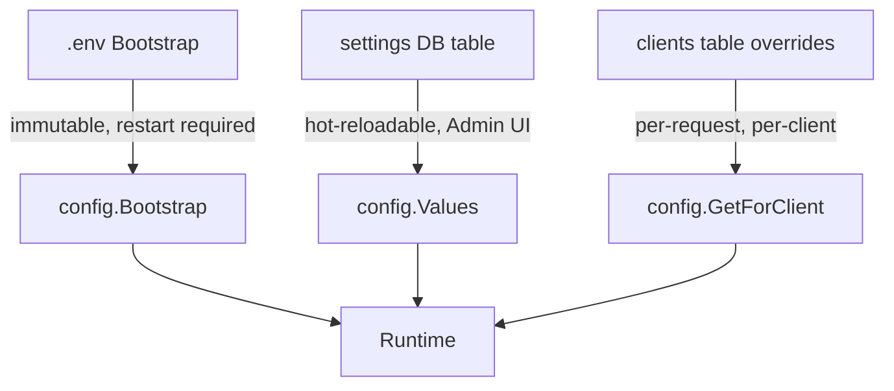
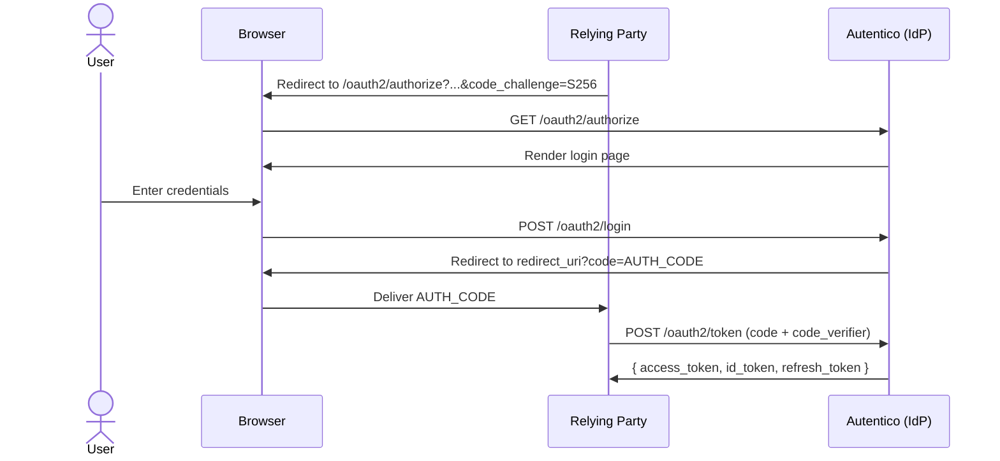
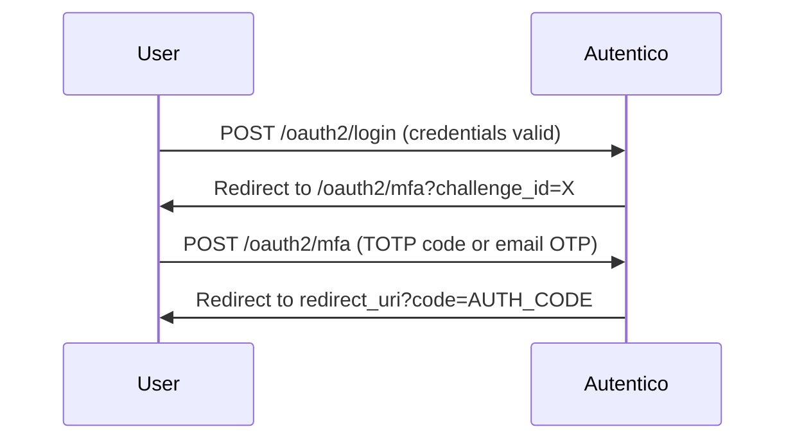

# Plan: Starlight Documentation Site (`docs-web/`)

## Context

Autentico has outgrown README-only documentation. The project now has passkeys, MFA, trusted devices, a full admin UI, a three-layer configuration system, and per-client overrides — none of which can be documented adequately in a single file. The goal is a professional, searchable documentation site at `docs.autentico.top` that serves operators, developers, and contributors.

Technology: Starlight (Astro's docs framework) — full-text search via Pagefind, MDX, dark mode, built-in navigation. Static site deploys to GitHub Pages via GitHub Actions. Custom domain handled by DNS CNAME + `public/CNAME` file.

## Decisions

- **Directory**: `docs-web/` (not `docs/` — already contains generated Swagger files)
- **Package manager**: pnpm (consistent with `admin-ui/`, `debug-ui/`)
- **No pnpm workspace** — standalone project, same pattern as `admin-ui/`
- **No versioning** — tracks main
- **Screenshots**: `<!-- TODO: add screenshot -->` comments inline where relevant
- **Mermaid diagrams**: enabled via `starlight-mermaid` plugin — use for auth flow sequence diagrams
- **Domain**: `docs.autentico.top` via GitHub Pages custom domain (no Caddy change needed)

---

## Step 1: Scaffold

From repo root:

```bash
pnpm create astro@latest docs-web -- --template starlight --skip-houston --no-install --no-git
cd docs-web && pnpm install
pnpm add starlight-mermaid
```

Update `docs-web/package.json`:
- Set `"name": "autentico-docs"`
- Add `"private": true`

---

## Step 2: `docs-web/astro.config.mjs`

```js
import { defineConfig } from 'astro/config';
import starlight from '@astrojs/starlight';
import starlightMermaid from 'starlight-mermaid';

export default defineConfig({
  site: 'https://docs.autentico.top',
  integrations: [
    starlight({
      title: 'Autentico',
      description: 'Documentation for the Autentico OpenID Connect Identity Provider',
      social: [
        { icon: 'github', label: 'GitHub', href: 'https://github.com/eugenioenko/autentico' },
      ],
      editLink: {
        baseUrl: 'https://github.com/eugenioenko/autentico/edit/main/docs-web/',
      },
      plugins: [starlightMermaid()],
      sidebar: [
        { label: 'Introduction', link: '/' },
        {
          label: 'Getting Started',
          items: [
            { label: 'Quickstart', link: '/getting-started/quickstart/' },
            { label: 'Installation', link: '/getting-started/installation/' },
          ],
        },
        {
          label: 'Deployment',
          items: [
            { label: 'Binary', link: '/deployment/binary/' },
            { label: 'Docker', link: '/deployment/docker/' },
            { label: 'Docker Compose', link: '/deployment/docker-compose/' },
            { label: 'Reverse Proxy', link: '/deployment/reverse-proxy/' },
            { label: 'Production Checklist', link: '/deployment/production-checklist/' },
          ],
        },
        {
          label: 'Configuration',
          items: [
            { label: 'Overview', link: '/configuration/overview/' },
            { label: 'Bootstrap Settings (.env)', link: '/configuration/bootstrap/' },
            { label: 'Runtime Settings', link: '/configuration/runtime-settings/' },
            { label: 'Per-Client Overrides', link: '/configuration/per-client-overrides/' },
          ],
        },
        {
          label: 'Authentication',
          items: [
            { label: 'Overview', link: '/authentication/overview/' },
            { label: 'Password', link: '/authentication/password/' },
            { label: 'Passkeys (WebAuthn)', link: '/authentication/passkeys/' },
            { label: 'MFA', link: '/authentication/mfa/' },
            { label: 'Trusted Devices', link: '/authentication/trusted-devices/' },
            { label: 'SSO Sessions', link: '/authentication/sso-sessions/' },
          ],
        },
        {
          label: 'Protocol Reference',
          items: [
            { label: 'Overview', link: '/protocol/overview/' },
            { label: 'Authorization Code + PKCE', link: '/protocol/authorization-code/' },
            { label: 'Refresh Tokens', link: '/protocol/refresh-tokens/' },
            { label: 'ROPC', link: '/protocol/ropc/' },
            { label: 'Token Structure & Claims', link: '/protocol/token-structure/' },
            { label: 'Scopes', link: '/protocol/scopes/' },
            { label: 'OIDC Discovery', link: '/protocol/oidc-discovery/' },
            { label: 'Introspection & Revocation', link: '/protocol/introspection-revocation/' },
          ],
        },
        {
          label: 'Clients',
          items: [
            { label: 'Overview', link: '/clients/overview/' },
            { label: 'Registering a Client', link: '/clients/registering/' },
            { label: 'Client Types', link: '/clients/client-types/' },
            { label: 'Per-Client Configuration', link: '/clients/per-client-configuration/' },
          ],
        },
        {
          label: 'Users',
          items: [
            { label: 'Overview', link: '/users/overview/' },
            { label: 'User Model', link: '/users/user-model/' },
            { label: 'Managing Users', link: '/users/managing-users/' },
            { label: 'Self-Signup', link: '/users/self-signup/' },
            { label: 'Account Lockout', link: '/users/account-lockout/' },
          ],
        },
        {
          label: 'Admin UI',
          items: [
            { label: 'Overview', link: '/admin-ui/overview/' },
            { label: 'Dashboard', link: '/admin-ui/dashboard/' },
            { label: 'Users', link: '/admin-ui/users/' },
            { label: 'Clients', link: '/admin-ui/clients/' },
            { label: 'Sessions', link: '/admin-ui/sessions/' },
            { label: 'Settings', link: '/admin-ui/settings/' },
          ],
        },
        {
          label: 'Integrate',
          items: [
            { label: 'Connecting an OIDC Client', link: '/integrate/connecting/' },
            { label: 'PKCE Flow Walkthrough', link: '/integrate/pkce-walkthrough/' },
            { label: 'Verifying Tokens', link: '/integrate/verifying-tokens/' },
          ],
        },
        {
          label: 'Security',
          items: [
            { label: 'Hardening', link: '/security/overview/' },
            { label: 'Incident Response', link: '/security/incident-response/' },
          ],
        },
        {
          label: 'API Reference',
          items: [
            { label: 'Endpoints', link: '/api-reference/endpoints/' },
          ],
        },
        {
          label: 'Architecture',
          items: [
            { label: 'Package Structure', link: '/architecture/package-structure/' },
            { label: 'Database Schema', link: '/architecture/database-schema/' },
            { label: 'Design Decisions', link: '/architecture/design-decisions/' },
          ],
        },
      ],
      customCss: ['./src/styles/custom.css'],
    }),
  ],
});
```

---

## Step 3: `.github/workflows/docs.yml`

```yaml
name: Docs

on:
  push:
    branches: [main]
    paths: ['docs-web/**']
  workflow_dispatch:

concurrency:
  group: pages
  cancel-in-progress: true

jobs:
  build:
    name: Build docs
    runs-on: ubuntu-latest
    steps:
      - uses: actions/checkout@v4

      - uses: actions/setup-node@v4
        with:
          node-version: '22'

      - uses: pnpm/action-setup@v4
        with:
          version: 9
          run_install: false

      - name: Get pnpm store path
        id: pnpm-cache
        run: echo "STORE_PATH=$(pnpm store path --silent)" >> $GITHUB_OUTPUT

      - uses: actions/cache@v4
        with:
          path: ${{ steps.pnpm-cache.outputs.STORE_PATH }}
          key: ${{ runner.os }}-pnpm-store-${{ hashFiles('docs-web/pnpm-lock.yaml') }}
          restore-keys: ${{ runner.os }}-pnpm-store-

      - run: cd docs-web && pnpm install --frozen-lockfile

      - run: cd docs-web && pnpm build

      - uses: actions/upload-pages-artifact@v3
        with:
          path: docs-web/dist

  deploy:
    name: Deploy to GitHub Pages
    needs: build
    runs-on: ubuntu-latest
    permissions:
      pages: write
      id-token: write
    environment:
      name: github-pages
      url: ${{ steps.deployment.outputs.page_url }}
    steps:
      - name: Deploy
        id: deployment
        uses: actions/deploy-pages@v4
```

---

## Step 4: Supporting files to create

| File | Content |
|------|---------|
| `docs-web/public/CNAME` | `docs.autentico.top` |
| `docs-web/src/styles/custom.css` | empty initially |

No logo SVG needed on first pass — omit the `logo` block from the config to avoid build failures.

---

## Step 5: All content files (51 total)

All in `docs-web/src/content/docs/`. Use `.mdx` throughout (allows future component use).

```
index.mdx
getting-started/quickstart.mdx
getting-started/installation.mdx
deployment/binary.mdx
deployment/docker.mdx
deployment/docker-compose.mdx
deployment/reverse-proxy.mdx
deployment/production-checklist.mdx
configuration/overview.mdx
configuration/bootstrap.mdx
configuration/runtime-settings.mdx
configuration/per-client-overrides.mdx
authentication/overview.mdx
authentication/password.mdx
authentication/passkeys.mdx
authentication/mfa.mdx
authentication/trusted-devices.mdx
authentication/sso-sessions.mdx
protocol/overview.mdx
protocol/authorization-code.mdx
protocol/refresh-tokens.mdx
protocol/ropc.mdx
protocol/token-structure.mdx
protocol/scopes.mdx
protocol/oidc-discovery.mdx
protocol/introspection-revocation.mdx
clients/overview.mdx
clients/registering.mdx
clients/client-types.mdx
clients/per-client-configuration.mdx
users/overview.mdx
users/user-model.mdx
users/managing-users.mdx
users/self-signup.mdx
users/account-lockout.mdx
admin-ui/overview.mdx
admin-ui/dashboard.mdx
admin-ui/users.mdx
admin-ui/clients.mdx
admin-ui/sessions.mdx
admin-ui/settings.mdx
integrate/connecting.mdx
integrate/pkce-walkthrough.mdx
integrate/verifying-tokens.mdx
security/overview.mdx
security/incident-response.mdx
api-reference/endpoints.mdx
architecture/package-structure.mdx
architecture/database-schema.mdx
architecture/design-decisions.mdx
```

---

## Step 6: Content tiers

### Tier 1 — Full real content (write now)

These pages are highest traffic and highest value:

**`index.mdx`** — splash landing page with `template: splash` frontmatter, feature list, links to quickstart and GitHub.

**`getting-started/quickstart.mdx`** — end-to-end: download binary → `autentico init` → `autentico start` → onboarding → first client. Use `<Steps>` component. `<!-- TODO: add screenshot of onboarding page -->`

**`configuration/bootstrap.mdx`** — full reference table of every `AUTENTICO_*` env var. Source: `pkg/config/config.go` `InitBootstrap()` and `pkg/cli/init.go`.

**`configuration/runtime-settings.mdx`** — full reference table of every settings DB key with default, type, and description. Source: `pkg/appsettings/load.go` `defaults` map and `LoadIntoConfig()`.

**`configuration/overview.mdx`** — explain the three-layer model with a Mermaid diagram:


**`protocol/authorization-code.mdx`** — full sequence diagram + step-by-step request/response:


**`protocol/refresh-tokens.mdx`** — refresh flow with Mermaid sequence diagram.

**`authentication/mfa.mdx`** — MFA flow diagram showing where the challenge is injected between login and auth code issuance:


### Tier 2 — Substantial content (write now, no full prose needed)

- `getting-started/installation.mdx` — binary download, Docker, from source
- `deployment/docker.mdx` — Dockerfile explanation + `docker run` example with all env vars
- `deployment/docker-compose.mdx` — annotated `docker-compose.yml`
- `deployment/reverse-proxy.mdx` — nginx config + Caddyfile snippets
- `deployment/production-checklist.mdx` — checklist format, all the secure cookie flags, TLS, secret rotation
- `configuration/per-client-overrides.mdx` — table of all 8 override fields
- `protocol/token-structure.mdx` — actual JWT claims from the codebase
- `protocol/oidc-discovery.mdx` — the discovery document fields
- `clients/registering.mdx` — full registration API call with all fields
- `clients/client-types.mdx` — confidential vs public, auth methods
- `integrate/connecting.mdx` — point any OIDC library at Autentico; show discovery URL
- `integrate/pkce-walkthrough.mdx` — the PKCE JS code from README, step-by-step
- `architecture/design-decisions.mdx` — SQLite rationale, RS256 rationale, three-layer config rationale

### Tier 3 — Stubs (frontmatter + one intro sentence + TODO comments)

All remaining pages. Template:

```mdx
---
title: Page Title
description: One-sentence description for SEO.
---

Brief intro sentence.

<!-- TODO: expand this section -->
<!-- TODO: add screenshot (if applicable) -->
```

---

## Step 7: Mermaid usage guide for content authors

The `starlight-mermaid` plugin renders `mermaid` fenced code blocks:

````mdx
```mermaid
sequenceDiagram
    ...
```
````

**Pages that should have Mermaid diagrams:**

| Page | Diagram type |
|------|-------------|
| `configuration/overview.mdx` | `graph TD` — three-layer config model |
| `protocol/authorization-code.mdx` | `sequenceDiagram` — full PKCE auth code flow |
| `protocol/refresh-tokens.mdx` | `sequenceDiagram` — refresh flow |
| `authentication/mfa.mdx` | `sequenceDiagram` — MFA challenge injection |
| `authentication/passkeys.mdx` | `sequenceDiagram` — WebAuthn ceremony |
| `authentication/overview.mdx` | `graph TD` — auth mode decision tree |
| `architecture/package-structure.mdx` | `graph TD` — package dependency overview |
| `integrate/pkce-walkthrough.mdx` | `sequenceDiagram` — PKCE flow from app perspective |

---

## Step 8: GitHub repository setup (manual, after merge)

1. **Settings > Pages > Source**: set to "GitHub Actions"
2. **Settings > Pages > Custom domain**: enter `docs.autentico.top`
3. **DNS**: add CNAME record `docs` → `eugenioenko.github.io` at DNS provider
4. Wait for propagation (~15 min), then enable **Enforce HTTPS**

The `public/CNAME` file prevents GitHub from clearing the custom domain on each deploy.

---

## Execution sequence

1. Scaffold Starlight in `docs-web/`
2. `pnpm install` + `pnpm add starlight-mermaid`
3. Replace `astro.config.mjs` with Step 2 version
4. Update `package.json` (name, private)
5. Create `public/CNAME`, `src/styles/custom.css`
6. Create all 51 `.mdx` content files — Tier 1 with real content, Tier 2 with substantial content, Tier 3 as stubs
7. `pnpm dev` — verify sidebar renders correctly
8. `pnpm build` — verify production build passes (broken links fail the build)
9. Create `.github/workflows/docs.yml`
10. Feature branch → PR → merge → verify GitHub Actions deploys successfully
11. Configure GitHub Pages settings + DNS

---

## Critical source files for content accuracy

| Source file | Used for |
|------------|---------|
| `pkg/config/config.go` | Bootstrap env vars, all runtime setting fields and defaults |
| `pkg/appsettings/load.go` | Settings DB keys, defaults map |
| `pkg/cli/start.go` | All HTTP routes — Protocol Reference and API Reference |
| `pkg/cli/init.go` | `autentico init` command — Quickstart |
| `pkg/db/db.go` | Database schema — Architecture/Database Schema |
| `README.MD` | Already has accurate content to draw from for prose |
